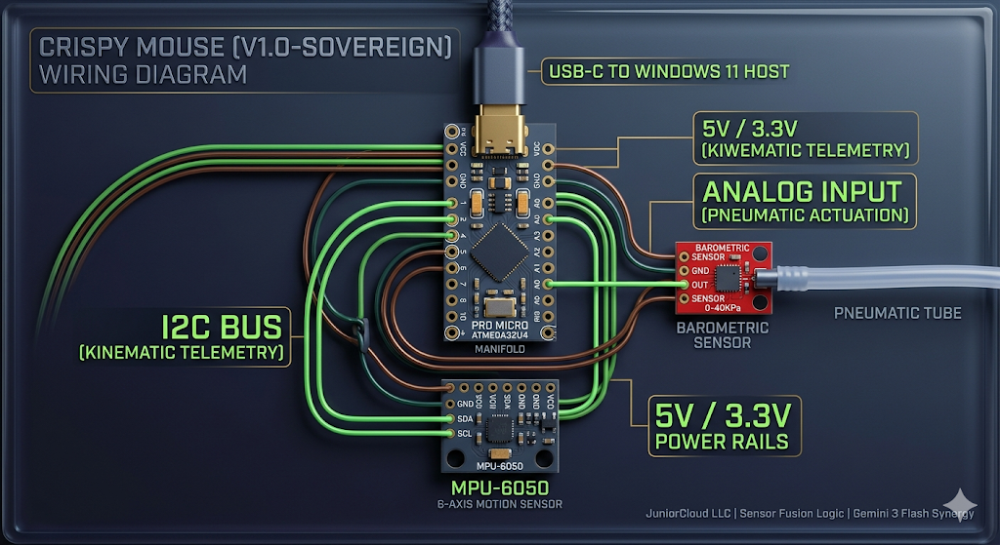

# crispy-mouse
to run: local (make flash) codespace webbrowser (make build)*also see below for setup
personal computer type and click onscreen keyboard "SUP mouse" with dampening variables, control pressure sensitivity, sequenced input commands + windows key "keybind"  ______________________________________________________
# Crispy Mouse (Assistive HID Manifold)

An edge-native, low-latency assistive hardware interface utilizing an ATmega32U4. It fuses kinematic telemetry (MPU-6050) and pneumatic data (0-40KPa Pressure Sensor) into standard USB Mouse HID compliance.

## System Architecture
* **Microcontroller:** ATmega32U4 (Arduino Leonardo Bootloader)
* **Kinematics:** MPU-6050 (I2C) with hardware-level 21Hz low-pass filtering.
* **Pneumatics:** 3.3-5V Analog Barometric Transducer.
* **Framework:** PlatformIO (Core)

## Key Functions
1.  **Exponential Moving Average (EMA) Smoothing:** Eliminates physiological jitter from the MPU-6050 by applying an adjustable alpha tensor (`DAMPER`) to the raw angular velocity vector.
2.  **Pneumatic Actuation (Breath Clicks):** Evaluates pressure deltas over distinct temporal windows:
    * *Single Puff (< 400ms):* Left Click
    * *Double Puff (< 400ms spacing):* Right Click
    * *Sustained Pressure (> 1200ms):* Execute topological origin reset.
3.  **Zero-Drift Deadzone:** A scalar threshold matrix that zeroes out micro-fluctuations when the sensor is static.
4.  **Topological Origin Reset (HOME):** Injects an extreme negative scalar vector to force the OS cursor to `(0,0)`, followed by an offset vector to approximate the center manifold. Recovers the cursor if lost.
5.  **Dynamic Parameter Injection:** Variables can be tuned in real-time via Serial communication without reflashing the ROM.

# 🖱️ Crispy Mouse SDK
**Sovereign Assistive Interface for Windows 11**

### 🚀 Seamless Setup (Windows 11 Only)
If you are here to use the device, do not use the "Open in Codespaces" button. Follow these steps:

1. **Clone/Download** this repo to your local Windows 11 PC.
2. **Plug in** your Tobii Eye Tracker and ATmega32U4.
3. **Double-click** `setup_local.bat`. This will handle all driver injections.
4. **Run Calibration:** ```powershell
   python crispy_calibrate.py

## Deployment Pipeline
Execute via `zsh` or bash terminal:
cd ~/Documents  # Or wherever you want the repo
git clone https://github.com/cloudcover95/crispy-mouse.git
cd crispy-mouse
# Using Homebrew (recommended for Apple Silicon)
brew install platformio

* `make build` - Compiles the firmware binary.
* `make flash` - Uploads to the MCU (requires local USB).
* `make hub` - Launches the Python CLI configurator.
